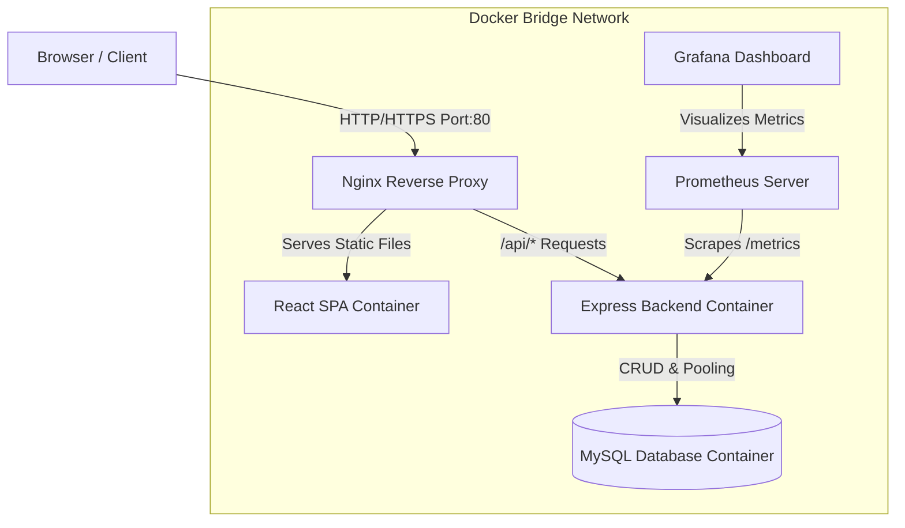

# Academix: Production-like College Management System

Welcome to **Academix**, a production-like College Management System designed to help junior DevOps engineers (~6 months of experience) master the core concepts of containerization, reverse proxying, CI/CD pipelines, cloud deployment, and observability.

This repository contains a full-stack web application integrated with Nginx, MySQL, Jenkins, Prometheus, and Grafana.

---

## High-Level Architecture Diagram



---

## Directory Structure

```text
college-app/
├── db/                       # Database seed files
│   └── init.sql              # MySQL schema & initial data injection
├── backend/                  # Node.js Express REST API
│   ├── src/
│   │   ├── config/db.js      # DB pool connectivity & reconnect retry logic
│   │   ├── controllers/      # CRUD controllers (students, courses, stats)
│   │   ├── middleware/       # Prometheus API latency collector
│   │   ├── routes/api.js     # API Route matching
│   │   └── server.js         # Express main server entrypoint
│   └── Dockerfile            # Lightweight Node production container
├── frontend/                 # React SPA (Vite)
│   ├── src/
│   │   ├── App.jsx           # UI Dashboard logic and state syncing
│   │   ├── index.css         # Custom modern styling & CSS charts
│   │   └── main.jsx          # Vite React mounting script
│   ├── index.html            # Main site HTML
│   ├── nginx.conf            # Custom Nginx serving SPA routing
│   └── Dockerfile            # Multi-stage compilation & serve container
├── nginx/                    # Public-facing Reverse Proxy
│   ├── default.conf          # Reverse proxy, rate limiting, and compression rules
│   ├── custom_502.html       # Visual fallback error page
│   └── Dockerfile            # Nginx proxy docker builder
├── prometheus/               # Monitoring Engine
│   └── prometheus.yml        # Metrics scraping configuration
├── grafana/                  # Visualization Engine
│   └── provisioning/         # Automates Prometheus datasource & dashboard importing
├── docker-compose.yml        # Orchestrates the complete stack locally
├── docker-compose.prod.yml   # Production compose (resource limits & log limits)
└── Jenkinsfile               # Declarative CI/CD build script
```

---

## Detailed Component Setup & Local Commands

### Prerequisites
Make sure you have installed:
- **Docker Desktop** (includes Docker Compose)
- **Git**

---

### Step 1: Run the Stack Locally
Clone this repository and run the following command in the project root:

```bash
docker compose up --build -d
```
* **`--build`**: Compiles all container images before starting.
* **`-d`**: Runs container processes detached in the background.

#### Verify Services Running
Check current container health states:
```bash
docker compose ps
```
The console will display `Up (healthy)` for the Database and Backend.

Access the services in your browser:
* **Frontend Web Application**: [http://localhost](http://localhost) (Proxied through Nginx on Port 80)
* **Backend Health Checks**: [http://localhost/health](http://localhost/health)
* **Raw Prometheus Metrics**: [http://localhost/metrics](http://localhost/metrics)
* **Prometheus Engine UI**: [http://localhost:9090](http://localhost:9090)
* **Grafana Dashboards**: [http://localhost:3000](http://localhost:3000) (Login: `admin` / `admin`)

---

## Phase-by-Phase Walkthrough & Interview Prep

### Phase 1: Database & Node.js Backend API
The backend exports a `/metrics` route which formats request count, latency averages, CPU, and heap memory logs into Prometheus-digestible keys. 

#### DevOps Best Practices Implemented:
* **Connection Pooling**: Reuses database sockets instead of creating new ones for every HTTP query, reducing load on MySQL.
* **Auto-Reconnect Retry**: Prevents backend container crashing if MySQL is slow to boot; backend attempts 5 connection attempts with 5-second back-off intervals.

#### 💬 Interview Questions:
1. **Q: Why do we use connection pools rather than opening a single connection for database commands?**
   * *A:* Opening database socket connections is computationally expensive. Connection pools keep a set of active connections open, reducing query latency and database overhead under high traffic.
2. **Q: How does a health check endpoint differ from simple ping testing?**
   * *A:* A simple ping only checks if the process is listening. A rich health check `/health` checks active database connectivity, query capability, and server dependencies to report if the app is truly "healthy".

---

### Phase 2: React Frontend
A clean SPA built with Vite. It features responsive dashboards, student lists, forms for adding courses/students, and real-time backend status logs.

#### DevOps Best Practices Implemented:
* **Decoupled API Base**: Fetches from relative route `/api`. This prevents CORS issues in production and lets the reverse proxy handle routing.

#### 💬 Interview Questions:
1. **Q: Why do we compile React files into static HTML/JS assets for production instead of running `npm run dev`?**
   * *A:* `npm run dev` spins up Node's development server, which handles hot-reloading and debug tracking. It is slow and uses heavy memory. Compiling files to static assets using `npm run build` lets Nginx serve them at high speeds with minimal CPU usage.

---

### Phase 3 & 4: Containerization & Nginx Reverse Proxy
Nginx acts as the gateway to client requests on port 80.

#### DevOps Best Practices Implemented:
* **Multi-Stage Dockerfiles**: The frontend build separates the compilation Node environment from Nginx runner. The final image size drops by >85% (from ~800MB to ~30MB).
* **Nginx Rate Limiting**: Limit API requests to 10/second per client IP address. Prevents brute-forcing or denial-of-service (DoS) attempts on database queries.
* **Security Headers**: Standard headers `X-Frame-Options` and `Content-Security-Policy` prevent Clickjacking and script injection attacks.

#### 💬 Interview Questions:
1. **Q: What is a multi-stage Docker build, and why is it crucial for production security?**
   * *A:* It allows using multiple temporary images during build phase (e.g. copying SDKs, dependencies) and copying only the compiled artifacts (e.g. static binaries or build directories) to the final runtime image. This reduces image size and limits attack vectors since compilers and package managers are excluded from production.
2. **Q: Explain how rate limiting works in Nginx.**
   * *A:* Nginx uses the **Leaky Bucket** algorithm via `limit_req_zone` and `limit_req`. Requests are queued in memory up to a burst limit, and anything exceeding this rate is immediately served a `503 Service Temporarily Unavailable` response.

---

### Phase 5: Prometheus & Grafana Monitoring
Observability metrics are gathered directly from our custom Express routes.

#### DevOps Best Practices Implemented:
* **Automatic Provisioning**: Grafana loads datasource settings and dashboards during container initialization. Operators don't have to manually configure charts on startup.

#### Key Prometheus Queries (PromQL):
* **Request Success Rate (req/s)**:
  ```promql
  sum(rate(http_request_duration_seconds_count[1m]))
  ```
* **Average Request Duration (seconds)**:
  ```promql
  rate(http_request_duration_seconds_sum[1m]) / rate(http_request_duration_seconds_count[1m])
  ```

#### 💬 Interview Questions:
1. **Q: What is the difference between a Pull-based and Push-based monitoring system?**
   * *A:* Prometheus uses **Pull-based** monitoring, scraping endpoints periodically (e.g., calling `/metrics` HTTP routes on targets). Push-based monitoring (like Datadog or CloudWatch) requires applications to actively push telemetry data to a central server.
2. **Q: What are the RED and USE monitoring frameworks?**
   * *A:* **RED** tracks **R**equest rate, **E**rrors, and **D**uration (ideal for microservices/APIs). **USE** tracks **U**tilization, **S**aturation, and **E**rrors (ideal for hardware/OS infrastructure monitoring).

---

### Phase 6: Jenkins CI/CD Pipeline
The `Jenkinsfile` defines a Jenkins pipeline checking out, linting, building, scanning, and pushing production containers to Docker Hub, then triggering an SSH script to deploy on AWS.

#### Setting up Jenkins locally:
Run Jenkins in Docker:
```bash
docker run -d -p 8080:8080 -p 50000:50000 --name jenkins -v jenkins_home:/var/jenkins_home jenkins/jenkins:lts-jdk17
```
Install the **SSH Agent** and **Docker Pipeline** plugins. Create global credentials:
1. `docker-hub-credentials` (Username/Password matching Docker Hub).
2. `ec2-ssh-key` (SSH Username/Private Key matching your EC2 `ubuntu` instance .pem key).

#### 💬 Interview Questions:
1. **Q: Why do we tag images with Build Numbers (e.g., `app:21`) instead of pushing everything as `:latest`?**
   * *A:* Pushing all images as `:latest` overwrites history, making rollback impossible. Using build numbers guarantees traceability, audit logs, and instant rollback capability to previous builds.
2. **Q: What does `StrictHostKeyChecking=no` do during SSH deployments, and how do you handle it securely?**
   * *A:* It bypasses interactive validation prompt asking to trust unknown remote host keys. While useful in automated scripts, in hardened environments you should pre-populate the Jenkins target `known_hosts` file rather than disabling checking globally.

---

### Phase 7: Production Cloud Deployment (AWS EC2)

To deploy the application to AWS EC2:

#### 1. Launch EC2 Instance
* Choose **Ubuntu Server 22.04 LTS** (t2.micro is eligible for free tier).
* Assign a Security Group with ingress ports:
  * **22** (SSH - restrict to your IP address).
  * **80** (HTTP - Open to Anywhere `0.0.0.0/0`).
  * **3000** (Grafana Dashboard access).

#### 2. Provision Host Script (`setup.sh`)
Execute this script inside the EC2 instance to configure Docker:
```bash
#!/bin/bash
sudo apt update -y
sudo apt install -y curl git apt-transport-https ca-certificates gnupg lsb-release

# Install Docker
curl -fsSL https://get.docker.com -o get-docker.sh
sudo sh get-docker.sh
sudo usermod -aG docker ubuntu
newgrp docker

# Verify Docker
docker --version
docker compose version
```

#### 3. Run Production Compose
Instead of building images on the remote machine (which crashes small instances due to CPU exhaustion), run the production config pulling pre-built Docker Hub images:
```bash
export IMAGE_TAG=latest
docker compose -f docker-compose.prod.yml up -d
```

---

## Common Errors & Troubleshooting

### Error 1: MySQL Container Exit with Error Code 137
* **Cause**: Container was killed by host OOM (Out Of Memory) killer due to insufficient RAM.
* **Resolution**: In production environments, ensure you set memory limits in `docker-compose.prod.yml` to prevent MySQL from exceeding host capacity, and add virtual SWAP memory to your t2.micro EC2 host.

### Error 2: Nginx Returns "502 Bad Gateway"
* **Cause**: Nginx is running, but cannot connect to the backend container.
* **Resolution**: 
  1. Check if backend container is running: `docker compose ps`
  2. Inspect backend logs: `docker compose logs backend`
  3. Ensure backend health check passes. Nginx cannot forward traffic to restarting containers.

### Error 3: Prometheus displays Target DOWN with error "no route to host"
* **Cause**: Containers are in different Docker networks, preventing DNS resolution.
* **Resolution**: Ensure all containers are joined to the same custom bridge network (`college-network`) specified in the `docker-compose.yml`. Do not use default default-bridge interface if you require internal service DNS resolutions.
